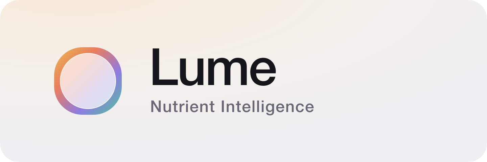

<div align="center">



<br />
<br />

**Nutrient intelligence for the way you actually eat.**

Lume is a beautifully-crafted nutrition companion concept — snap your plate, track macros and micronutrients, and surface AI-driven insights that connect what you eat to how you feel.

<br />


</div>

---

## ✨ Overview

Lume is a high-fidelity, iOS-style product prototype for a nutrition-tracking app. It runs entirely in the browser — no bundler, no install — using React and Babel Standalone loaded from a CDN, rendered inside a realistic on-desk phone frame with an aurora glassmorphism aesthetic.

> All data is original mock data — Lume is a design concept, not a real company or medical product.

---

## 🧭 Screens

| Screen | What's inside |
| --- | --- |
| 🏠 **Home** | Daily macro rings, water, recent meals, and "For you" cards powered by Lume AI |
| 📸 **Log** | Point-the-camera plate capture, detected components, and portion estimates |
| 🧬 **Nutrients** | Micronutrient heatmap showing % of daily targets across vitamins & minerals |
| 💡 **Insights** | Correlation insights (e.g. afternoon fatigue vs. magnesium) with confidence scores |
| 👤 **Profile** | Supplement stack, wearable connections, and lab-result uploads |

---

## 🎨 Design System

- **Aurora backdrops** — layered `oklch` radial gradients with switchable vibes (aurora, dawn, mist, meadow)
- **Glassmorphism** — reusable frosted-glass surfaces with tinted variants (sage, coral, peri, gold)
- **Typography** — [Geist](https://vercel.com/font) & Geist Mono for numerals, Instrument Serif for accents
- **Live tweaks panel** — adjust accent hue, background vibe, glass strength, and layout density in real time

---

## 🗂 Project Structure

```
Lume/
├── Lume.html            # Entry point — loads React, Babel & all modules
├── ios-frame.jsx        # On-desk iPhone frame + status bar
├── tweaks-panel.jsx     # Live design-token editor
└── src/
    ├── app.jsx          # App shell — tab routing & tweak state
    ├── icons.jsx        # Icon set & brand glyphs
    ├── data.jsx         # Mock meals, macros, nutrients & insights
    ├── primitives.jsx   # Cards, gauges, bars, wordmark & shared UI
    ├── screen-home.jsx
    ├── screen-log.jsx
    ├── screen-nutrients.jsx
    ├── screen-insights.jsx
    └── screen-profile.jsx
```

---

## 🚀 Running Locally

No build step required — just serve the folder and open `Lume.html`.

```bash
# From the repo root, start any static server
python3 -m http.server 8000
```

Then visit **http://localhost:8000/Lume.html** in your browser.

> A static server is recommended over opening the file directly, so the browser can load the `.jsx` modules.

---

<div align="center">
<br />

Designed & built with 💛 by [@ishan-crd](https://github.com/ishan-crd)

</div>
